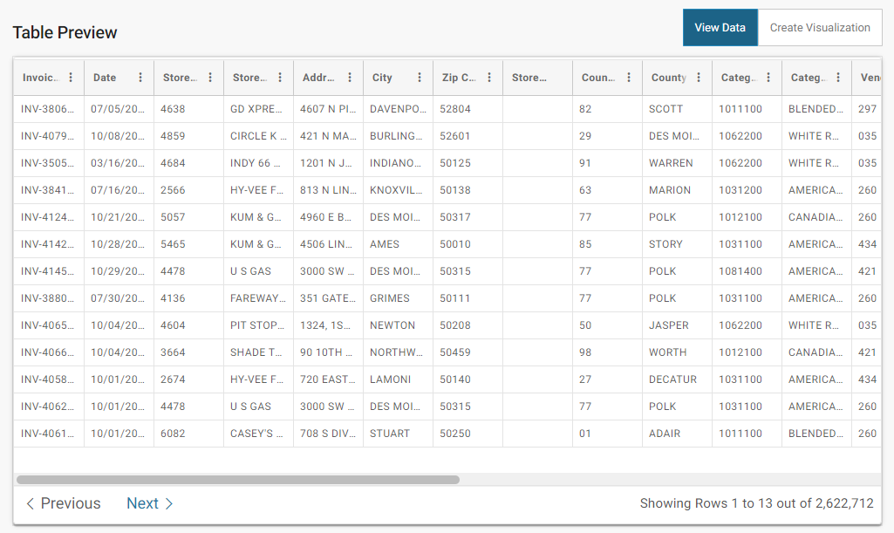

# Trabalho 1

## Dataset

[2021 Iowa Liquor Sales][dataset-link]

## Tech stack

| Nome                                | Versão  |
| :---------------------------------- | :------ |
| [MongoDB][mongodb-link]             | 7.0     |
| [TypeScript][typescript-link]       | 5.2.2   |
| [Node.js][nodejs-link]              | 18.18.1 |
| [Express.js][expressjs-link]        | 4.18.2  |
| [Mongoose][mongoose-link]           | 7.6.1   |
| [Python][python-link]               | 3.11.1  |
| [Docker][docker-link]               | 24.0.6  |
| [Apache JMeter][apache-jmeter-link] | 5.6.2   |

## Tutorial

1. Instale o [Studio 3T][studio-3t-link]
2. Instale o [Docker Desktop][docker-desktop-link]
3. Execute o script [`up.ps1`][script-link] como administrador
4. Faça o download dos [arquivos de backup][backup-link] e coloque-os em `./database/backups/elc137t1db/`
5. Através do Studio 3T, conecte-se ao MongoDB pela URI `mongodb://127.0.10.1:27017,127.0.10.2:27017,127.0.10.3:27017`
   1. Acesse o menu `Import > BSON - mongodump folder`
      1. Em `Source folder`, selecione o diretório de backups `./database/backups/`
      2. Em `Target connection`, selecione a conexão realizada ao MongoDB no passo 4
      3. Em `Import sources`, selecione o banco de dados `elc137t1db` e a coleção `sales`
      4. Em `BSON options`, marque a opção `Drop collection before import (--drop)`
      5. Execute o comando `Run`

<!-- Links -->

[dataset-link]:        <https://data.iowa.gov/Sales-Distribution/2021-Iowa-Liquor-Sales/cc6f-sgik> "2021 Iowa Liquor Sales"
[studio-3t-link]:      <https://studio3t.com/>                                                     "Studio 3T"
[docker-desktop-link]: <https://www.docker.com/products/docker-desktop/>                           "Docker Desktop"
[script-link]:         <./up.ps1>                                                                  "Script"
[backup-link]:         <https://drive.google.com/drive/folders/1xLdWh5HWdyORVx7XtA88LuZIwY4sIc9l>  "Backup"
[mongodb-link]:        <https://www.mongodb.com/>                                                  "MongoDB"
[typescript-link]:     <https://www.typescriptlang.org/>                                           "TypeScript"
[nodejs-link]:         <https://nodejs.org/en>                                                     "Node.js"
[expressjs-link]:      <https://expressjs.com/>                                                    "Express.js"
[mongoose-link]:       <https://mongoosejs.com/>                                                   "Mongoose"
[python-link]:         <https://www.python.org/>                                                   "Python"
[docker-link]:         <https://www.docker.com/>                                                   "Docker"
[apache-jmeter-link]:  <https://jmeter.apache.org/>                                                "Apache JMeter"
